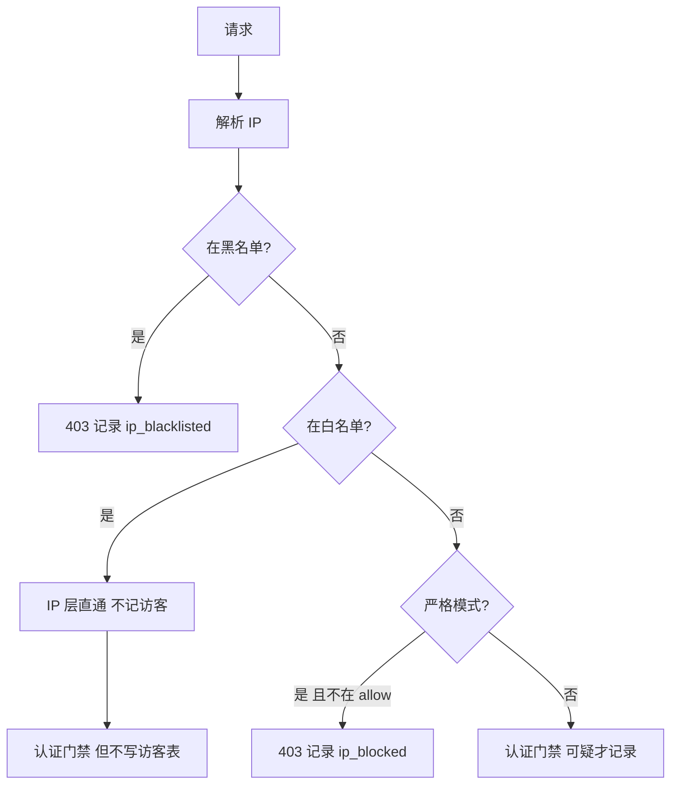

# dsh-local-hanaccount v2 方案

**状态：** v2.1 核心已落地；**v2.2 路由全包 + 对等配对** 见 §0.8（已确认，待实现）  
**版本目标：** v2.1（当前）→ v2.2（路由 / Token / 对等）  
**定位：** DSH Web **访问锁**（密码 / Passkey + IP 白黑名单 + 登录遮罩 + **全站插件路由保护**）  
**场景：** 默认上外网  
**原则：** **功能做全、界面做简** — 一页设置、可折叠区块、无 Tab / 无多步向导  
**架构原则：** **插件互不适配** — hc 不为任何插件写专用逻辑；认证在 hc 平台层透明完成

---

## 0. v2 产品规格（简单但做全）

> **界面简单，能力不砍。** 复杂选项放进折叠区，默认只露最常用的。

### 0.1 整体流程

```text
首次打开 → 设密码 → 进 DSH
           （若 IP 不在白名单，顶部黄条：「请添加当前 IP」）

每次访问 → 白名单/黑名单检查 → 登录（密码 或 密钥）→ 用原生 DSH

设置页   → 一个页面，几块可折叠，改配置
```

### 0.2 设置页（一页，无 Tab）

```text
┌─ 访问控制 ──────────────────────────────────────────┐
│ 已阻挡非法访问：276 次                               │
│ 您当前 IP：203.0.113.50   [加白名单]  [加黑名单]     │
│                                                     │
│ 访问密码                              [修改]        │
│                                                     │
│ IP 白名单（信任，不记访客）                          │
│   127.0.0.1 / 203.0.113.50          [删] [+当前IP] │
│                                                     │
│ IP 黑名单（永久拒绝）                                │
│   45.33.32.156                      [删]           │
│                                                     │
│ 最近被挡 / 可疑（最多 20 条）                        │
│   91.200.x.x  挡 12 次  昨天   [加白] [加黑] [忽略]  │
│                                                     │
│ ▶ 第二台设备（SSH 密钥）                            │
│     粘贴公钥 / 查看 authorized_keys / CLI 说明      │
│                                                     │
│ ▶ Nginx                                             │
│     [复制完整配置]  [检测是否经反代]                 │
│     [ ] Nginx 已设 Basic 密码 → 免二次登录（默认关） │
│                                                     │
│ ▶ 仅内网使用                                        │
│     [ ] 关闭 IP 限制（仍要密码）                     │
└─────────────────────────────────────────────────────┘
```

**交互原则：**

- 首屏只露：阻挡次数、当前 IP、密码、白名单、最近被挡
- 黑名单 / 密钥 / Nginx / 内网开关 → **默认折叠**
- 没有「简洁/高级」两套 UI，没有五个 Tab

### 0.3 功能清单（v2.0 全做，但每项都简单）

| 功能 | 怎么做（简单版） |
|------|-----------------|
| **密码登录** | 首次设密码；遮罩登录；argon2id + 输错 5 次锁 30 分钟 |
| **IP 白名单** | 列表 +「添加当前 IP」；名单内 IP **直通、不记访客** |
| **IP 黑名单** | 小列表 + 从「最近被挡」一键加黑；命中即 403 |
| **严格默认** | 不在白名单且不在「仅内网」豁免 → 挡掉并计数 |
| **阻挡统计** | 一个大数「已阻挡非法访问 N 次」 |
| **可疑记录** | 只记非白名单的可疑行为；登录成功后不记 |
| **Nginx** | 折叠里一整段配置可复制；一键检测是否经反代 |
| **Nginx Basic** | 折叠里 **一个勾选**（默认关），开了则透传后自动 Cookie |
| **Passkey** | HTTPS 或 localhost 自动可用；浏览器指纹/面容一键登录 |
| **SSH 密钥** | 折叠区；CLI/脚本用（手动签名） |
| **内网模式** | 折叠里 **一个勾选**：关 IP 限制，密码仍要 |
| **防 IP 伪造** | 写死 `trustedProxies: [127.0.0.1]`，用户不可改坏 |

**v2.0 仍不做（真的以后再说）：**

- 多账户 / 工作区隔离  
- 五 Tab / 三步向导 / 简洁高级双模式  
- 三种网络策略单选（用：白名单 + 黑名单 + 内网勾选 代替）

### 0.4 请求怎么走

```text
1. 内网模式开？ → 跳过 IP 列表，直接到登录
2. 在黑名单？   → 403，记 ip_blacklisted，计数 +1
3. 在白名单？   → 不记访客，到登录
4. 不在白名单？ → 403，记 ip_blocked，计数 +1
5. 有 Cookie？  → 进 DSH
6. Nginx Basic 勾选且头有效？ → 自动 Cookie
7. 否则 → 登录页（密码 或 密钥 challenge）
```

| 访客记录 | |
|---------|---|
| 白名单 IP | 不记 |
| 黑名单/被挡 | 记 |
| 非白名单输错密码 | 记 |
| 登录成功后 | 不记 |

`totalIllegalBlocked` = 黑名单挡 + 非白名单挡 + 未授权直访（不含 login_failed）

### 0.5 默认配置

```yaml
enabled: true
passwordHash: ""
allow: ["127.0.0.1", "::1"]
deny: []
ipLimitEnabled: true          # 「仅内网」勾选 = false
trustProxy: true
trustedProxies: ["127.0.0.1", "::1"]
nginxBasicAutoLogin: false
keyAuthEnabled: true          # 折叠里配公钥后才生效
```

### 0.6 实施顺序

| 步 | 内容 |
|----|------|
| 1 | 删 v0.1 多账户 + 全部 patch |
| 2 | 密码 + 登录遮罩 |
| 3 | 白/黑名单 + 阻挡计数 + 可疑列表 |
| 4 | 设置页（一页 + 折叠） |
| 5 | Nginx 折叠 + Basic 勾选 |
| 6 | 密钥折叠 + 登录页密钥入口 |
7. Passkey 登录/注册 + README

### 0.7 Passkey（v2.1）

- **不判断有没有域名**；看当前请求是否 `HTTPS` 或 `localhost`/`127.0.0.1`
- `rpId` = 当前 `Host` 主机名（域名或 IP）
- 客户端：`window.isSecureContext && PublicKeyCredential`
- 登录：已注册 Passkey 时默认 Tab；否则仅密码
- 注册：设置页「添加本机 Passkey」（需已登录）
- 局域网 HTTP（`192.168.x.x`）不显示 Passkey

### 0.8 路由全包、对等配对与插件无关（v2.2，已确认）

> **产品决策（2026-08）：** hc 只做平台级保护；各插件（含 `dsh-plugin-repo`）**互不适配**。跨机通信用 Token；单端 hc 可用「显式暴露」；`dsh-plugin-repo` **仅删除** v1.6 临时 Basic 登录，**不增加** hc 集成代码。

#### 0.8.1 目标

| 目标 | 做法 |
|------|------|
| 默认保护所有插件暴露的 HTTP 路由 | `protect-all`：wrap `webServer.prefixes`（及 `exact` 路由表） |
| 两台 DSH 互相同步 / 调用 | 在 hc 里 **配对**，自动使用 **Peer Token**（Bearer） |
| 只有一端装 hc | 在 **有 hc 的一端** 配置 `excludePrefixes` **显式暴露**所需 prefix |
| 插件零互适配 | hc **不出现**任何插件名；出站 Token 由 hc **透明注入** |
| 替代 plugin-repo 临时 Basic | rp 删 Basic 字段与 `remoteAuthHeaders`；恢复「只填地址」 |

#### 0.8.2 当前实现缺口（v2.1）

| 路由 | v2.1 现状 |
|------|-----------|
| `/api` + `/api/events.*` | ✅ 已 wrap |
| `/pluginrepo`、`/dsh-version-updater/*`、其他插件 prefix | ❌ 未保护 |
| 出站 fetch 自动带 Token | ❌ 未实现 |
| 配对 / Peer 存储 | ❌ 未实现 |

#### 0.8.3 路由策略：`protect-all` + 显式暴露

**默认：** 所有经 `webServer.register` 注册的 **prefix**（及 **exact** 路径）均走同一套 gate（IP + 认证），**不**写死 `/api`、`/pluginrepo` 等插件名。

**永不保护（代码写死，用户不可关）：**

- 静态资源（HTML / JS / CSS — 一般不在 `prefixes` 内；未登录须能加载登录页）
- hc 自身公开 API：`/dsh-local-hanaccount/api/auth/*`、`status` 等（在 handler 内或规则中放行）

**显式暴露 `excludePrefixes`：**

- 列出的 prefix **跳过登录门禁**（IP 策略建议仍生效，可配置）
- 用于：**仅一端有 hc**、对端裸 DSH 需访问本机某插件 API（如 `/pluginrepo`）
- 设置页 **醒目警告** + 保存确认；可选审计「对暴露路径的访问」
- 与配对 Token **二选一**：公网长期暴露应优先「两端 hc + 配对」，再移除 exclude

```yaml
routePolicy:
  mode: protect-all          # 默认；仅此模式（v2.2）
  excludePrefixes: []        # 显式暴露，例：["/pluginrepo"]
```

#### 0.8.4 入站认证（gate 统一判定）

```text
请求进入
  ├─ path 匹配 excludePrefixes？ ──是──► 跳过登录（IP 策略可选仍检查）
  ├─ hc 公开 auth 路径？ ──是──► 放行
  ├─ IP 策略拒绝？ ──是──► 403
  ├─ 有效会话 Cookie（密码 / Passkey 登录）？ ──是──► 放行
  ├─ 有效 Bearer（Peer Token 或手动 API Token）？ ──是──► 放行
  └─ 否则 ──► 401
```

- **Peer Token**：两机配对时签发，存 hc 数据目录（哈希存盘，明文仅配对成功时展示一次）
- **手动 API Token**（可选）：脚本 / CI / 未配对场景；与 Peer 共用同一校验逻辑

#### 0.8.5 对等配对（两机都有 hc）

```text
机器 B：hc 设置 →「添加对等设备」→ 短时配对码
机器 A：填 B 的 baseUrl + 配对码 → 确认
结果：
  A 存 peer 记录（id、名称、baseUrl、出站 token）
  B 存 peer 记录 + 认可该 token 入站（可配置双向配对）
```

**插件无感知：** 被访问方插件 handler 不改；gate 在校验 Token 后照常 `next()`。

#### 0.8.6 出站透明注入（关键：插件不必改）

本机任意插件（含 `dsh-plugin-repo`）继续裸 `fetch('https://vps.example.com/pluginrepo/api/...')`。

hc 在 **DSH 宿主进程** 层 hook 出站 `fetch`（或 DSH 统一 outbound HTTP）：

```text
fetch(url)
  → URL 的 origin 命中已配对 peer.baseUrl？
      是 → 自动附加 Authorization: Bearer <peer-token>
      否 → 原样发出（防止 Token 泄露到其他站点）
```

- **不要求** 插件 `import` hc、**不要求** `peerFetch` 专用 API
- 使用非全局 `fetch` 的插件（自建 HTTP 客户端）可能绕过 — 文档说明限制；后续可考虑 DSH 核心统一出站（非 v2.2 必须）

#### 0.8.7 部署场景矩阵

| 场景 | 配置 | plugin-repo 改动 |
|------|------|------------------|
| 两端都有 hc，已配对 | `protect-all`，无 exclude；出站 hook 带头 | **仅删** Basic 临时代码 |
| 仅被访问方（VPS）有 hc | VPS：`excludePrefixes: [/pluginrepo]`；`/api` 仍锁 | **仅删** Basic |
| 仅发起方有 hc | 对方无 gate；本机 protect-all 保护本机 | **仅删** Basic |
| 两端无 hc | 与现网一致 | 删 Basic 后 LAN 直连 |
| 公网 + 单端 hc + exclude | 可用但风险自担；建议 Nginx 限 IP 或尽快双端配对 | **仅删** Basic |

#### 0.8.8 hc 与 plugin-repo 边界（非目标）

**hc 不做：**

- `import` / 判断 `dsh-plugin-repo`
- 为 `/pluginrepo` 写专用分支（除用户配置的 `excludePrefixes`）
- 修改 rp 源码

**plugin-repo 不做：**

- hc 检测、`peerFetch`、Token UI、localStorage 远程密码
- v1.6 Remote Basic Auth（**删除**）：`remoteAuthHeaders`、`username`/`password` 表单项、API body 凭据、相关 README

**Nginx Basic：** 保留为可选 **外层**反代；DSH 主登录以 hc 为准。`nginxBasicAutoLogin` 不与 plugin-repo 耦合。

#### 0.8.9 设置页新增（折叠区）

```text
▶ 路由保护
    模式：默认保护所有插件 API（只读说明）
    显式暴露的路由：[/pluginrepo] [+添加]  ⚠ 公网风险

▶ 对等设备
    已配对：家里 VPS  https://vps.example.com  [撤销]
    [生成配对码]  /  [使用配对码连接其他设备]

▶ API 密钥（可选）
    手动签发 / 撤销（脚本用；与 Peer Token 校验相同）
```

#### 0.8.10 v2.2 实施顺序

| 步 | 内容 | 状态 |
|----|------|------|
| 1 | `routePolicy` 配置 + `protect-all` wrap 全部 `prefixes` / `exact` + 晚注册轮询 | ✅ |
| 2 | gate 入站：Bearer 校验框架 + `excludePrefixes` | ✅ |
| 3 | Peer 存储、配对 API（配对码 TTL）、入站认可 Peer Token | ✅ |
| 4 | 出站 `fetch` 透明注入（按 peer.baseUrl 匹配） | ✅ |
| 5 | 设置页：显式暴露 + 对等设备 + API Token | ✅ |
| 6 | 测试：wrap、配对、exclude、Bearer | ✅ 20 tests |
| 7 | **plugin-repo**：删除 v1.6 Basic 相关 | ✅ v1.8.0 |

#### 0.8.11 v2.2 验收标准

- [ ] 未登录 `curl /pluginrepo/api/packages` → 401（未 exclude 时）
- [ ] 未登录 `curl /api/...` → 401（保持）
- [ ] `excludePrefixes: [/pluginrepo]` 后，`/pluginrepo` 无 Token 可访问；`/api` 仍 401
- [ ] 两机配对后，本机裸 `fetch` 对方 `/pluginrepo/api/...` 成功（无 rp 改认证代码）
- [ ] hc 源码无 `plugin-repo` / `pluginrepo` 专用业务分支（exclude 为用户配置除外）
- [ ] 静态资源 / hc 公开 auth 路径在未登录时可访问
- [ ] plugin-repo 已移除 Basic 跨设备 UI 与 `remoteAuthHeaders`

---

> **以下 §1 起为旧版详细草案，实现以 §0 为准。**

## 1. 产品定位（参考）

| 维度 | v0.1（现状） | v2（目标） |
|------|-------------|-----------|
| 核心能力 | 多用户 + 每账户工作区隔离 | **单实例访问保护** |
| 账户模型 | `users[]` + admin/user 角色 | **单一操作者**（密码 + SSH 式密钥） |
| 工作区 | 插件管理 per-user 目录 | **完全交给 DSH 原生**，插件不碰 |
| Nginx | 未设计 | **可选模式**，用户自行选择 |
| 配置方式 | 仅 YAML patch | **网页设置页 + YAML**（网页优先） |

**一句话：** 给 DSH Web 加一把「本地门锁」——**默认按公网标准配好**，内网开发一键切换。

---

## 2. 两种运行模式

> **默认：Nginx 公网模式。** 普通直连模式保留给内网/开发，在简洁设置页底部切换。

用户在 **高级设置** 或首配向导末尾可选择 **部署模式**：

### 2.1 内网模式（原「普通模式」）

适合：本机 / 局域网直连、无反代、开发环境。

```
浏览器 ──直连──► DSH :3080
                  ├─ 登录遮罩（密码 / 密钥）
                  ├─ IP 白名单（可选，基于 remoteAddress）
                  └─ 会话 Cookie
```

| 特性 | 说明 |
|------|------|
| 无需 Nginx | 开箱即用 |
| IP 白名单 | 默认 `trustProxy: false`，只用 TCP 源 IP，**不可伪造** |
| 登录方式 | 密码 + SSH 式密钥文件 |
| 推荐场景 | `127.0.0.1`、内网单机、笔记本本地开发 |

### 2.2 公网模式（原「Nginx 增强模式」，**默认**）

适合：外网暴露、TLS 终结、反代、与现有 `auth_basic` 联动。

```
浏览器 ──HTTPS──► Nginx ──127.0.0.1──► DSH :3080
                    ├─ TLS / allow-deny
                    ├─ auth_basic（可选）
                    └─ 写入 X-Real-IP / Authorization
                              │
                              ▼
                         插件读取（仅信任 127.0.0.1）
                         ├─ IP 白名单（读转发头）
                         ├─ Basic 透传自动登录（可选）
                         └─ 登录遮罩 / 密钥
```

| 特性 | 说明 |
|------|------|
| 需要 Nginx | 设置页提供配置片段一键复制 |
| IP 白名单 | `trustProxy: true` + `trustedProxies: [127.0.0.1]` |
| Nginx Basic | 浏览器在 Nginx 登录后，可**自动签发 DSH Cookie**（免二次登录） |
| 推荐场景 | `dsh.wannian.fun` 类公网部署 |

### 2.3 模式对比表

| 项目 | 普通模式 | Nginx 增强模式 |
|------|---------|---------------|
| 依赖 | 无 | Nginx 反代 |
| IP 来源 | `remoteAddress` | `X-Real-IP`（仅信任代理） |
| IP 伪造风险 | 低 | 低（需正确配 `trustedProxies`） |
| TLS | DSH 自带或 HTTP | Nginx 终结 |
| Basic 联动 | 不支持 | 支持透传自动登录 |
| 设置页 | 简化选项 | 多 Nginx 配置向导 + 片段复制 |
| 切换 | 简洁页「切换到内网宽松」/ 高级里改 | 默认，向导首配 |

> **重要：** 内网模式仍完整可用；**安装默认走公网标准预设**（§0），避免用户上外网时漏配 Nginx / 漏加 IP。

---

## 3. 认证方式（并存）

v2 保留三种登录入口，用户在设置页分别开关：

| 方式 | 说明 | 典型场景 |
|------|------|---------|
| **密码登录** | argon2id 哈希，防暴力锁定 | 本机浏览器人工登录 |
| **SSH 式密钥** | 服务端 `authorized_keys` + 客户端私钥文件 | 第二台电脑、CI、脚本 |
| **Nginx Basic 透传** | 仅 Nginx 模式；验证 `Authorization: Basic` 后自动 Cookie | 已在 Nginx 登录的用户 |

### 3.1 SSH 式密钥（双机文件）

**不是** HTTP Header 静态 secret，而是公钥/私钥文件配对：

| 机器 | 文件 | 内容 |
|------|------|------|
| DSH 服务器 | `~/.dsh/storages/dsh-local-hanaccount/authorized_keys` | 公钥列表（OpenSSH 格式） |
| 客户端电脑 | `~/.dsh/keys/dsh-gate.key` | 私钥（chmod 600，永不上传） |

流程：

```text
1. GET  /auth/key/challenge     → { challengeId, nonce, expiresIn: 60 }
2. 客户端用私钥文件签名 nonce
3. POST /auth/key/verify        → { challengeId, signature }
4. 服务端 authorized_keys 验签 → Set-Cookie
```

CLI（计划提供）：

```bash
# 客户端生成密钥对
dsh gate keygen -o ~/.dsh/keys/dsh-gate
# 公钥追加到服务器 authorized_keys（设置页可粘贴）

# 客户端一键登录
dsh gate login --url https://dsh.example.com --key ~/.dsh/keys/dsh-gate.key
```

---

## 4. IP 访问控制（白名单 + 黑名单）

### 4.0 概念区分（重要）

| 列表 | 语义 | IP 层行为 | 安全访客记录 |
|------|------|----------|-------------|
| **白名单 `allow`** | 信任网段 / 已知好 IP | **直接放行**，不拦 | **一律不记**（连登录失败也不进访客表） |
| **黑名单 `deny`** | 已知坏 IP / 扫描源 | **403 拒绝** | **必记** + 计入 `totalIllegalBlocked` |
| **既不在白也不在黑** | 普通访客 | 放行 IP 层，继续走登录门禁 | 仅在有可疑行为时记（输错密码、未登录直访等） |

> 旧方案把「只允许名单内 IP」叫白名单并记录拦截——那是 **严格模式 + 黑名单式记录**。v2 明确拆分：**白名单 = 信任不记；黑名单 = 拦截必记**。

### 4.1 判定顺序（每个请求）

```text
解析客户端 IP
  │
  ├─ 1. 在黑名单 deny？ → 403 + 记 ip_blacklisted + totalIllegalBlocked++
  │
  ├─ 2. 在白名单 allow？ → IP 层直接通过（trusted zone）
  │                        此后全程不写 security-visitors
  │                        仍须登录（除非另有会话 Cookie / Nginx Basic）
  │
  ├─ 3. 严格模式 strictAllow 开启？
  │        └─ 不在 allow → 403 + 记 ip_blocked + totalIllegalBlocked++
  │
  └─ 4. 普通未知 IP → IP 层通过 → 进入认证门禁
           ├─ 有 Cookie → 放行
           ├─ 登录失败 → 记 login_failed（非白名单 IP 才记）
           └─ 未登录直访受保护资源 → 记 unauthenticated + totalIllegalBlocked++
```



**白名单 IP 的「不记录」范围：** 该 IP 触发的任何事件（`login_failed`、`unauthenticated`、`lockout` 等）**全部跳过** `security-visitors` 写入。仅写可选 debug 审计（默认关）。

### 4.2 三种网络策略（设置页单选）

| 策略 | 说明 | 适用 |
|------|------|------|
| **开放（默认）** | 只启用黑名单；不在黑白名单的 IP 正常走登录 | 内网、本机 |
| **严格** | 只有白名单 `allow` 能过 IP 层；其余 403 并记录为 `ip_blocked` | 公网、仅允许固定网段 |
| **仅黑名单** | 同开放，但强调只维护 `deny` 列表 | 封已知攻击源 |

开放 / 仅黑名单：`strictAllow: false`  
严格：`strictAllow: true`（须至少配置一条 `allow`，否则拒绝保存）

### 4.3 威胁模型（IP 伪造）— 白名单尤其要小心

白名单 IP 享有 **信任直通 + 不写访客记录**。若攻击者能伪造自己属于白名单网段，等于进入「隐形区」：不触发告警、不记登录失败，危害 **远大于** 伪造黑名单或普通 IP。

#### 4.3.1 伪造能否成功，取决于 IP 从哪来

| 配置 | 远程攻击者能否伪造白名单 IP |
|------|---------------------------|
| 普通模式，`trustProxy: false`，用 `remoteAddress` | **不能**（TCP 源地址不可伪造） |
| Nginx 模式，`trustedProxies: [127.0.0.1]`，仅 Nginx 写 `X-Real-IP` | **不能**（客户端碰不到 DSH，无法自带假头） |
| `trustProxy: true` 且 `trustedProxies` 为空 | **能** — 直连 DSH 并发送 `X-Forwarded-For: 192.168.1.1` → **禁止保存此配置** |
| DSH `:3080` 对公网暴露 + `trustProxy: true` | **能** — 即使配了 trustedProxies，非代理直连仍可伪造 |

#### 4.3.2 白名单专用防护（实现 + 文档强制）

| 规则 | 说明 |
|------|------|
| **禁止空 trustedProxies** | `trustProxy: true` 时 `trustedProxies` 非空，否则配置保存失败 |
| **直连忽略转发头** | `remoteAddress ∉ trustedProxies` 时 **绝不** 读 `X-Forwarded-For` / `X-Real-IP`，只用 `remoteAddress` |
| **白名单不放过大网段（警告）** | 设置页对 `0.0.0.0/0`、`10.0.0.0/8` 等写 allow 时弹 **黄色警告**（不禁止，但提示伪造/误配风险） |
| **公网严格模式默认建议** | 检测 deployMode=nginx 且 strictAllow 时，README/向导建议 allow 用 **/32 单 IP**，少用整段 CIDR |
| **自检卡片** | 设置页展示：「当前请求识别为 `x.x.x.x`（来源：直连 / Nginx 转发）」「是否在白名单：是/否」 |
| **防火墙** | 文档写明：DSH 只 bind `127.0.0.1`；外网只能经 Nginx 进入 |

#### 4.3.3 伪造成功后的影响（为何白名单更敏感）

```text
伪造进白名单网段（最坏情况）
  → IP 层直通
  → 不写 security-visitors（登录失败也看不见）
  → 仍须密码/密钥，但 brute-force 对管理员不可见
  → 侧栏「已阻挡 N 次」不增加
```

因此：**白名单信任与 IP 解析正确性强绑定**；IP 解析不可信时，应降级为「不在白名单」而非误放行。

#### 4.3.4 推荐生产拓扑（防伪造白名单）

```text
Internet → Nginx（TLS, allow/deny）→ 127.0.0.1:3080（DSH）
              │ writes X-Real-IP only
              └ trustedProxies: [127.0.0.1]

allow 列表示例：办公室出口单 IP /32，而非 0.0.0.0/0
```

**不要：** 公网暴露 3080 + `trustProxy: true` + allow `10.0.0.0/8` — 攻击者直连并伪造 XFF 即可伪装内网。

### 4.4 实现规则（fail-closed）

1. `trustProxy` 默认 `false`（普通模式）
2. 切换到 Nginx 模式时，自动设 `trustProxy: true`，`trustedProxies: [127.0.0.1, ::1]`
3. 只有 `remoteAddress ∈ trustedProxies` 时才读 `X-Forwarded-For` / `X-Real-IP`
4. 解析 XFF 取**最右可信代理左侧**一段作为客户端 IP
5. 设置页显示「当前检测到的客户端 IP」供用户自检
6. 文档建议：生产环境防火墙封死 3080 外网访问

### 4.5 安全访客记录（仅非白名单 IP 的可疑访问）

**定位：** 安全事件日志。**白名单 IP 永不写入。** 黑名单 IP 只在被挡时写入。其余 IP 仅在可疑行为时写入。

#### 4.5.1 记 / 不记

| 事件 | 白名单 IP | 黑名单 IP | 普通未知 IP |
|------|----------|----------|------------|
| 命中黑名单被挡 | — | ✅ `ip_blacklisted` | — |
| 严格模式被挡（不在 allow） | — | — | ✅ `ip_blocked` |
| 密码错误 | ❌ 不记 | —（已被挡） | ✅ `login_failed` |
| 未登录直访 | ❌ 不记 | — | ✅ `unauthenticated` |
| 登录成功 / 已登录访问 | ❌ 不记 | — | ❌ 不记 |

**会话豁免（仅非白名单 IP）：** 登录成功后 Cookie 有效期内不记正常流量。

#### 4.5.2 数据模型

存储：`~/.dsh/storages/dsh-local-hanaccount/security-visitors.json`

按 **可疑 IP 聚合**（不是按每次请求一条流水，避免膨胀）：

```json
{
  "version": 1,
  "stats": {
    "totalIllegalBlocked": 276,
    "totalBlacklistedHits": 89,
    "totalStrictBlocked": 53,
    "totalBlockedIps": 17,
    "totalLoginFailures": 38,
    "totalUnauthenticated": 91,
    "since": "2026-08-20T00:00:00.000Z"
  },
  "visitors": {
    "203.0.113.50": {
      "ip": "203.0.113.50",
      "firstSeenAt": "2026-08-23T01:00:00.000Z",
      "lastSeenAt": "2026-08-23T01:05:00.000Z",
      "eventCount": 8,
      "reasons": {
        "ip_blacklisted": 5,
        "login_failed": 0,
        "unauthenticated": 0
      },
      "lastReason": "ip_blacklisted",
      "lastPath": "/api/events.host",
      "userAgent": "Mozilla/5.0 ...",
      "status": "blocked",
      "whitelisted": false
    }
  },
  "pendingAlerts": ["203.0.113.50"]
}
```

| 字段 | 说明 |
|------|------|
| `eventCount` | 该 IP 累计可疑事件（**白名单 IP 不会出现于此表**） |
| `reasons.ip_blacklisted` | 命中黑名单次数 |
| `reasons.ip_blocked` | 严格模式下因不在 allow 被挡次数 |
| `stats.totalBlacklistedHits` | 黑名单拦截总次数 |
| `stats.totalStrictBlocked` | 严格模式拦截总次数 |
| **`stats.totalIllegalBlocked`** | `ip_blacklisted` + `ip_blocked` + `unauthenticated` + `lockout` |

#### 4.5.3 概览统计

```text
┌──────────────────────────────────────────────────────────────┐
│           本插件已阻挡非法访问                                  │
│                    276                                       │
├──────────────────────────────────────────────────────────────┤
│ 黑名单拦截    严格模式拦截    未授权直访      登录失败(非白名单) │
│     89            53            91              38           │
└──────────────────────────────────────────────────────────────┘
```

#### 4.5.4 访客表操作

| 场景 | 操作 |
|------|------|
| 黑名单 / 严格模式拦截 | **[加入白名单]**（信任，以后不记） **[加入黑名单]** **[忽略]** |
| 普通 IP 登录失败 | **[加入黑名单]** **[加入白名单]** **[忽略]** |

- `POST .../security-visitors/:ip/allow` → 加入白名单 `allow`，移出访客表
- `POST .../security-visitors/:ip/deny` → 加入黑名单 `deny`
- `POST .../security-visitors/:ip/dismiss` → 仅忽略，不改黑白名单

#### 4.5.5 网络 Tab UI

两个独立列表编辑器 + 访客表：

| 区块 | 内容 |
|------|------|
| **白名单 allow** | 信任 IP/CIDR；说明：「名单内 IP 直接放行，**不记录**访客」 |
| **黑名单 deny** | 禁止 IP/CIDR；说明：「名单内 IP 一律拦截并记录」 |
| **网络策略** | 开放 / 严格（仅 allow 过 IP 层）/ 仅黑名单 |
| **安全访客记录** | 仅非白名单的可疑 IP（见上表列） |

**容量：** 最多 300 条可疑 IP；`totalIllegalBlocked` 不随访客清理减少。

#### 4.5.6 配置项

```yaml
ipAccess:
  strictAllow: false
  allow: ["127.0.0.1", "::1"]
  deny: []
  trustProxy: false
  trustedProxies: []

securityVisitors:
  enabled: true
  alertOnBlacklistHit: true
  alertOnStrictBlock: true
  alertOnLoginFailure: false
  retentionDays: 90
```

---

## 5. 网页设置页（核心交付）

### 5.1 入口与 Slot

与 `dsh-plugin-repo` 一致，注册 DSH 设置区块：

```javascript
slots.register({
  name: 'settings.section',
  id: 'dsh-local-hanaccount',
  order: 15,
  label: '访问控制',
}, GateSettingsSection)
```

另保留：

- `shell.overlay` — 未登录全屏遮罩（`LoginGate`，`order: -1000`）
- `sidebar.footer.action` — 快捷状态「已锁定 / 已解锁」
- `conversation.session.header.actions` — 顶栏 Chip

### 5.2 UI 风格规范（对齐现有插件）

复用 `dsh-plugin-repo` 的视觉体系，**不引入新设计系统**：

| 元素 | 规范 |
|------|------|
| CSS 变量 | `--dsw-alias-label-primary/secondary`、`--dsw-alias-bg-base`、`--dsw-alias-border-l1`、`--dsw-font-family` |
| 品牌色 | `#4d6bfe`（与 plugin-repo 一致） |
| 字号 | 标题 16px/600，正文 13px，辅助 12px |
| 圆角 | 卡片 10px，按钮/输入 6px |
| 组件 | `TabBar`、`Banner`（ok/warn/error）、`Toolbar`、`Collapsible`、`Badge` |
| 字体 | `ui-monospace` 用于路径、公钥、IP |
| 反馈 | 顶部 `Banner` 显示保存结果；危险操作用红色描边按钮 |

参考文件：

- `dsh-plugin-repo/lib/client.js` — TabBar、Banner、btn()、inputStyle
- `dsh-version-autoupdate/src/client.tsx` — 状态轮询、胶囊/面板交互（次要参考）

### 5.3 页面结构（Tab 布局）

```
设置 → 访问控制
┌─────────────────────────────────────────────────────────┐
│  [概览]  [认证]  [网络]  [Nginx]  [高级]                  │  ← TabBar
├─────────────────────────────────────────────────────────┤
│  Banner: 当前模式 / 告警 / 保存提示                       │
│  ... 当前 Tab 内容 ...                                   │
│  [保存配置]  [需要重启 DSH 生效]                          │
└─────────────────────────────────────────────────────────┘
```

#### Tab：概览

| 区块 | 内容 |
|------|------|
| 运行状态 | 已启用 / 未配置密码 / 锁定中 |
| **部署模式** | 单选：**普通模式** / **Nginx 增强模式**（带简短说明卡片） |
| 当前会话 | 登录方式、过期时间、「退出所有会话」 |
| **安全访客** | 主 KPI「本插件已阻挡非法访问」+ 分项统计 + 最近可疑 IP 列表（见 §4.3） |
| 安全评分 | 简表：密码强度 / 白名单 / 密钥数量 / Nginx 状态 / 待处理可疑 IP 数 |

#### Tab：认证

| 区块 | 内容 |
|------|------|
| 密码 | 设置/修改密码（argon2id）；显示是否已配置 |
| 登录保护 | 最大尝试次数、锁定时长 |
| 会话 | Cookie 有效期、空闲超时 |
| 密钥登录 | 开关；`authorized_keys` 列表（注释、指纹、撤销） |
| 添加公钥 | 粘贴 OpenSSH 公钥 / 上传 `.pub` 文件 |
| 配对向导 | 三步：生成密钥 → 复制公钥 → 测试连接 |

#### Tab：网络

| 区块 | 内容 |
|------|------|
| IP 访问控制 | **白名单**（信任直通、不记）+ **黑名单**（拦截必记）；网络策略：开放/严格/仅黑名单 |
| **安全统计** | 主 KPI + 黑名单拦截 / 严格拦截 / 未授权 / 登录失败分项 |
| 快捷添加 | 「本机」「当前访问 IP」「局域网 192.168.0.0/16」 |
| 自检 | 显示「您当前的 IP：x.x.x.x」「白名单判定：允许/拒绝」 |
| 普通模式提示 | `trustProxy` 关闭，使用直连 IP |
| Nginx 模式提示 | 仅信任 `127.0.0.1` 转发头（只读展示） |

**安全访客记录表格：**

```text
┌────────────────┬──────┬──────┬────────┬──────────┬──────────┬─────────────┐
│ IP             │ 事件 │ 拦截 │ 登录失败│ 未授权   │ 最近     │ 操作        │
├────────────────┼──────┼──────┼────────┼──────────┼──────────┼─────────────┤
│ 203.0.113.50   │  8   │  5   │   2    │    1     │ 09:55    │ [加白][忽略]│
│ 192.168.1.99   │  3   │  0   │   3    │    0     │ 09:40    │ [忽略]      │
└────────────────┴──────┴──────┴────────┴──────────┴──────────┴─────────────┘
```

- `203.0.113.50`：非法 IP，被白名单挡 5 次 → 可加白
- `192.168.1.99`：白名单内但密码输错 3 次 → 只记录，默认不加白按钮（或仅忽略）

状态 Badge：

- **可疑 / 已阻挡** — 红色或蓝色（有 `ip_blocked`）
- **仅登录失败** — 琥珀色
- **已加白** — 绿色
- **已忽略** — 灰色

#### Tab：Nginx

> 仅在「Nginx 增强模式」下完整展示；普通模式下显示灰色说明 +「切换到 Nginx 模式」按钮。

| 区块 | 内容 |
|------|------|
| 联动开关 | Nginx Basic 透传自动登录 on/off |
| 连接检测 | 检测是否经反代访问（`X-Real-IP` 是否存在且来自可信代理） |
| 配置片段 | 可折叠代码块，一键复制：`location /` 反代 + `auth_basic` + 透传 `Authorization` |
| 检查清单 | □ DSH 只监听 127.0.0.1 □ 防火墙封 3080 □ TLS 证书 □ trustedProxies |
| 故障排查 | 404 / 401 / 双重登录 等常见问题的 Banner 说明 |

示例片段（设置页内展示，用户复制到 Nginx）：

```nginx
# DSH 访问控制 — Nginx 增强模式（由插件设置页生成）
upstream dsh_backend {
    server 127.0.0.1:3080;
    keepalive 8;
}

server {
    listen 443 ssl http2;
    server_name dsh.example.com;

    # 可选：IP 限制（第一道防线）
    # allow 192.168.0.0/16;
    # deny all;

    # 可选：Nginx Basic（与插件联动时需透传 Authorization）
    # auth_basic "DSH";
    # auth_basic_user_file /etc/nginx/dsh.htpasswd;

    location / {
        proxy_pass http://dsh_backend;
        proxy_http_version 1.1;
        proxy_set_header Host $host;
        proxy_set_header X-Real-IP $remote_addr;
        proxy_set_header X-Forwarded-For $proxy_add_x_forwarded_for;
        proxy_set_header X-Forwarded-Proto $scheme;
        proxy_set_header Authorization $http_authorization;  # Basic 联动关键
        proxy_set_header Upgrade $http_upgrade;
        proxy_set_header Connection $connection_upgrade;
    }
}
```

#### Tab：高级

| 区块 | 内容 |
|------|------|
| 审计日志 | 最近 50 条：登录成功/失败、IP 拒绝、密钥验签 |
| 阻挡统计 | 只读展示 `totalIllegalBlocked`；**[重置统计]**（需确认，写 audit） |
| 数据目录 | 只读展示 `dataDir` 路径 |
| 导出/导入 | 导出配置 JSON（不含密码明文）；导入 authorized_keys |
| 恢复默认 | 重置为普通模式默认配置（需确认） |

### 5.4 配置持久化

| 层级 | 说明 |
|------|------|
| 运行时 | `~/.dsh/storages/dsh-local-hanaccount/config.json`（插件写入） |
| 启动合并 | `cordis.patch.yml` 默认值 ← `config.json` 覆盖（网页保存写 config.json） |
| 敏感字段 | 密码只存 hash；保存 API 不回传明文 |
| 生效 | 大部分项保存即生效；模式切换 / 端口类提示重启 DSH |

Host API（设置页调用）：

```text
GET  /dsh-local-hanaccount/api/config          # 读配置（脱敏）
PUT  /dsh-local-hanaccount/api/config          # 写配置
GET  /dsh-local-hanaccount/api/status          # 运行状态、当前 IP、模式
POST /dsh-local-hanaccount/api/config/test-ip  # 测试某 IP 是否在白名单
GET  /dsh-local-hanaccount/api/audit           # 审计日志分页
GET  /dsh-local-hanaccount/api/keys              # authorized_keys 列表
POST /dsh-local-hanaccount/api/keys            # 添加公钥
DELETE /dsh-local-hanaccount/api/keys/:id      # 撤销公钥
GET  /dsh-local-hanaccount/api/security-visitors/stats   # totalIllegalBlocked + 分项统计
POST /dsh-local-hanaccount/api/security-visitors/stats/reset  # 重置累计阻挡统计（需已登录）
GET  /dsh-local-hanaccount/api/security-visitors        # 可疑访客列表（分页）
GET  /dsh-local-hanaccount/api/security-visitors/alerts # 待处理（非法 IP 等）
POST /dsh-local-hanaccount/api/security-visitors/:ip/allow
POST /dsh-local-hanaccount/api/security-visitors/:ip/deny    # 加入黑名单
POST /dsh-local-hanaccount/api/security-visitors/:ip/dismiss
DELETE /dsh-local-hanaccount/api/security-visitors/:ip
```

---

## 6. 登录遮罩 UI（未登录时）

保留 v0.1 全屏遮罩思路，简化为双 Tab：

```
┌──────────────────────────────────────┐
│         DSH 访问控制                  │
│  [密码登录]  [密钥登录]               │
│                                      │
│  密码 Tab：用户名（固定 operator）     │
│           密码输入框                   │
│                                      │
│  密钥 Tab：显示 challenge QR/文本      │
│           「在此电脑运行配对命令」      │
│           粘贴签名（高级）              │
│                                      │
│  底部链接：「打开设置」（需已登录/admin）│
└──────────────────────────────────────┘
```

Nginx 模式 + Basic 已透传时：**不显示遮罩**，直接进入 DSH。

---

## 7. 配置 Schema（合并后）

```yaml
- id: dsh-local-hanaccount
  config:
    enabled: true

    # 部署模式：standalone | nginx
    deployMode: standalone

    passwordHash: ""              # 网页设置后写入
    passwordEnv: "DSH_GATE_PASSWORD"  # 可选，优先于 hash

    session:
      maxAgeDays: 7
      idleTimeoutMinutes: 480

    lockout:
      maxAttempts: 5
      lockMinutes: 30

    ipAccess:
      strictAllow: false
      allow: ["127.0.0.1", "::1"]
      deny: []
      trustProxy: false
      trustedProxies: []

    keyAuth:
      enabled: true
      authorizedKeysFile: ""      # 默认 dataDir/authorized_keys
      challengeTtlSeconds: 60

  # 仅 deployMode: nginx 时生效
    nginx:
      basicPassThrough: true      # Authorization Basic → 自动 Cookie
      # trustedProxies 与 whitelist 共用

    securityVisitors:
      enabled: true
      alertOnBlockedIp: true
      alertOnLoginFailure: false
      alertWhileBrowsing: true
      pollIntervalSeconds: 15
      maxPendingAlerts: 20
      retentionDays: 90
      sessionGrace: true          # 登录成功后同 IP 不记正常访问

    # v2.2：路由全包 + 显式暴露（§0.8）
    routePolicy:
      mode: protect-all
      excludePrefixes: []         # 例：["/pluginrepo"] — 单端 hc 或临时开放

    # v2.2：对等设备与 Token（§0.8.5）；peers.json 存盘，token 哈希
    # peers 由设置页 / 配对 API 写入，一般不手写 patch
```

**v2.2 运行时文件（`dataDir`）：**

| 文件 | 用途 |
|------|------|
| `peers.json` | 对等设备 id、名称、baseUrl、token 哈希、创建时间 |
| `api-tokens.json` | 可选手动 API Token（哈希） |

**删除的 v0.1 字段：** `users[]`、`role`、`rememberLogin`（合并进 session）、全部工作区相关 state。

---

## 8. 代码结构

```text
src/
├── index.js           # apply()、路由、模式编排
├── config.js          # 读/写 config.json、与 patch 合并
├── gate.js            # IP + 会话 + Bearer gate；wrap 全 prefix
├── route-policy.js    # protect-all / excludePrefixes 匹配（v2.2）
├── peers.js           # 配对、peer 存储、配对码 TTL（v2.2）
├── outbound-fetch.js  # 出站 fetch hook，按 peer 注入 Token（v2.2）
├── whitelist.js       # IP 解析、CIDR、伪造防护
├── security-visitors.js  # 可疑访客记录、统计、sessionGrace 豁免
├── nginx.js           # Basic 透传、模式检测
├── key-auth.js        # challenge/verify、authorized_keys
├── session.js         # Cookie 签发/校验
├── audit.js           # 审计日志
├── client.js          # 设置页 + 登录遮罩（对齐 plugin-repo UI）
└── cli/               # dsh gate keygen / login（可选分包）

test/
├── gate.test.js
├── whitelist.test.js
├── security-visitors.test.js
├── key-auth.test.js
└── nginx.test.js
```

**删除（v0.1）：** `patchWorkspaceRegistry`、`patchDirectoryPicker`、`patchSessionListing`、client 工作区/会话 filter、多用户 store。

---

## 9. 实施顺序

| PR | 内容 | 依赖 |
|----|------|------|
| PR0 | **公网标准预设 + 3 步首配向导 + 简洁设置页**（§0） | — |
| PR1 | 删多账户 + 删全部 patch；密码登录遮罩 | PR0 |
| PR2 | `config.json` + 设置页骨架（TabBar / Banner / 概览 Tab） | PR1 |
| PR3 | 认证 Tab：密码 hash、lockout、会话 | PR2 |
| PR4 | 网络 Tab：IP 白名单 + 普通/Nginx 模式切换 | PR2 |
| PR4b | **黑白名单 + 安全访客记录**（§4.0–4.5） | PR4 |
| PR5 | 密钥：authorized_keys + challenge/verify + 认证 Tab 密钥 UI | PR3 |
| PR6 | Nginx Tab：片段生成、Basic 透传、连接检测 | PR4 |
| PR7 | `dsh gate keygen/login` CLI | PR5 |
| PR8 | 审计日志、高级 Tab、README、迁移指南 | PR6, PR4b |
| **PR9** | **v2.2：`protect-all` + `excludePrefixes`**（§0.8.3） | v2.1 |
| **PR10** | **v2.2：Bearer / Peer Token 入站 gate**（§0.8.4–0.8.5） | PR9 |
| **PR11** | **v2.2：出站 fetch 透明注入 + 配对 UI**（§0.8.5–0.8.9） | PR10 |
| **PR12** | **plugin-repo：删除 v1.6 Basic**（§0.8.8；与 hc 无代码耦合） | 可与 PR9 并行 |

---

## 10. 数据迁移（v0.1 → v2）

| v0.1 | v2 处理 |
|------|---------|
| `state.workspaces[]` | 丢弃 |
| `state.sessionOwners[]` | 丢弃 |
| `state.sessions{}` | 清空，全部重新登录 |
| `state.currentUser` | 丢弃 |
| `config.users[]` | 取第一个用户密码迁移为单凭证；无则需网页首次设置 |
| `dataDir/users/` | 保留不删，文档说明可手动清理 |

升级后首次打开设置页：向导引导选择**普通模式**或 **Nginx 模式**。

---

## 11. 验收标准

### 普通模式

- [ ] 不安装 Nginx 可完成：设置密码 → 登录 → 使用 DSH 原生工作区
- [ ] 设置页可配置白名单，直连 IP 判定正确且不可伪造
- [ ] **概览显示「本插件已阻挡非法访问」累计总数（`totalIllegalBlocked`）**
- [ ] **非法 IP 被白名单阻挡时记入安全访客，并计入 `totalIllegalBlocked`**
- [ ] **密码错误、未登录直访记入；登录成功后同 IP 正常访问不记**
- [ ] **一键加白后非法 IP 可放行，并从待处理列表移除**
- [ ] 已登录管理员可收到非法 IP 被挡 Toast（可关）
- [ ] 密钥登录：双机文件配对后可 CLI 登录
- [ ] 5 次密码错误触发锁定

### Nginx 模式

- [ ] 设置页切换到 Nginx 模式，展示配置片段并可复制
- [ ] 经 Nginx 反代后，插件正确读取 `X-Real-IP`
- [ ] Basic 透传开启时，Nginx 登录后无需 DSH 二次密码
- [ ] 直连 3080 伪造 `X-Forwarded-For` 不能绕过白名单

### UI

- [ ] 设置 →「访问控制」五 Tab 可用，风格与 `dsh-plugin-repo` 一致
- [ ] 部署模式单选：普通 / Nginx，切换有说明和保存提示
- [ ] Banner 反馈保存成功/失败/需重启

### 安全

- [ ] 密码 argon2id 存储；API 不返回 hash/明文
- [ ] `trustProxy: true` 时 `trustedProxies` 非空（否则拒绝保存）
- [ ] 审计日志记录登录与 IP 拒绝

---

## 12. 用户文档大纲（README 将改写为）

1. 简介：公网 3 步首配（密码 → IP → Nginx）
2. 简洁设置页说明
3. 切换到内网开发模式
4. 高级：密钥、黑名单、审计
5. 故障排查（含 IP 变了怎么办）
6. 从 v0.1 升级

---

## 13. 已确认的产品决策

| 决策 | 结论 |
|------|------|
| **界面** | 一页 + 折叠；无 Tab、无向导 |
| **功能** | 白/黑名单、密码、Passkey、密钥、Nginx+Basic、阻挡统计、内网勾选 — **v2.0/v2.1 全做** |
| 多账户 / 工作区隔离 | **删除** |
| IP | 白名单=信任不记；黑名单=永拒；默认严格 |
| 防伪造 | trustProxy 写死 127.0.0.1 |
| **路由保护（v2.2）** | **默认 `protect-all`** 包所有插件 prefix；**`excludePrefixes` 显式暴露** |
| **跨机认证（v2.2）** | **两机 hc 配对 + Peer Token**；出站 **透明 hook fetch**，插件不改 |
| **单端 hc** | **exclude** 放出所需路由（如 `/pluginrepo`）；`/api` 仍可锁 |
| **插件互不适配** | hc 不写插件名；**rp 只删 Basic**，不加 hc 集成 |
| **plugin-repo Basic** | **临时方案，删除**；由 hc 全包 / 配对 / exclude 取代 |

---

## 14. 参考

- 现有插件 UI：`dsh-plugins/dsh-plugin-repo/lib/client.js`
- plugin-repo 跨设备（将移除 Basic）：`dsh-plugins/dsh-plugin-repo/README.md` — v2.2 后改由 hc §0.8 覆盖
- v0.1 计划（已过时）：`docs/hanaccount-plan-v1.md`
- v0.1 代码审查：`docs/hanaccount-review-v1.md`
